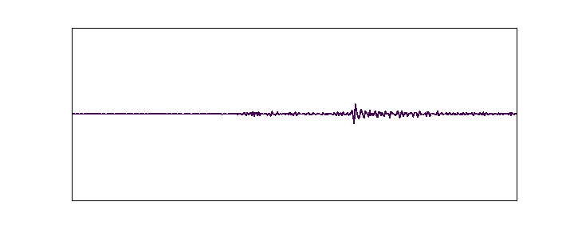

[](https://www.codefactor.io/repository/github/aradfarahani/seismology)

# Seismology



# Coming Soon!!!!!!!!!!!!!!!!!!!!!!!!!!!!!!!!!!!!!!!!!!!!!!

Welcome to the Seismology repository! This project is dedicated to the application of machine learning techniques in the field of seismology. Our goal is to provide tools and resources for analyzing seismic data and improving earthquake detection and characterization.


## Table of Contents

- [Introduction](#introduction)
- [Features](#features)
- [Data Sources](#data-sources)
- [Installation](#installation)
- [Contributing](#contributing)
- [License](#license)
- [Acknowledgements](#acknowledgements)

## Introduction

Seismology is a project aimed at leveraging machine learning to enhance the analysis of seismic data. By utilizing advanced algorithms, we aim to improve the accuracy and efficiency of earthquake detection and characterization.

## Features

- **Data Preprocessing**: Tools for cleaning and preparing seismic data for analysis.
- **Machine Learning Models**: Implementation of various ML models for seismic event detection and classification.
- **Visualization**: Tools for visualizing seismic data and model outputs.
- **Benchmarking**: Standardized benchmarks for evaluating model performance.

## Data Sources

This project utilizes the following data sources:

- [Seismic data from ObsPy](https://examples.obspy.org/RJOB_061005_072159.ehz.new)
- [Earthquake data from USGS](https://earthquake.usgs.gov/earthquakes/feed/v1.0/summary/2.5_month.csv)

## Installation

To get started with Seismology, clone the repository:

```bash
git clone https://github.com/aradfarahani/Seismology.git
cd Seismology
```

## Contributing

We welcome contributions from the community! If you'd like to contribute, please follow these steps:

1. Fork the repository.
2. Create a new branch (`git checkout -b feature-branch`).
3. Make your changes.
4. Commit your changes (`git commit -m 'Add new feature'`).
5. Push to the branch (`git push origin feature-branch`).
6. Open a pull request.

## License

This project is licensed under the MIT License. See the [LICENSE](LICENSE) file for more details.

## Acknowledgements

We would like to thank all the contributors and the open-source community for their support.


<!DOCTYPE html>
<html lang="en">
<head>
    <meta charset="UTF-8">
    <meta name="viewport" content="width=device-width, initial-scale=1.0">
    <title>Seismicity Map</title>
</head>
<body>
    <h1>Seismicity Map</h1>
    <iframe src="https://raw.githubusercontent.com/aradfarahani/Seismology/main/seismicity_map.html" width="100%" height="600px" frameborder="0"></iframe>
</body>
</html>


<iframe src="https://raw.githubusercontent.com/aradfarahani/Seismology/main/seismicity_map.html" width="100%" height="600px" frameborder="0"></iframe>
